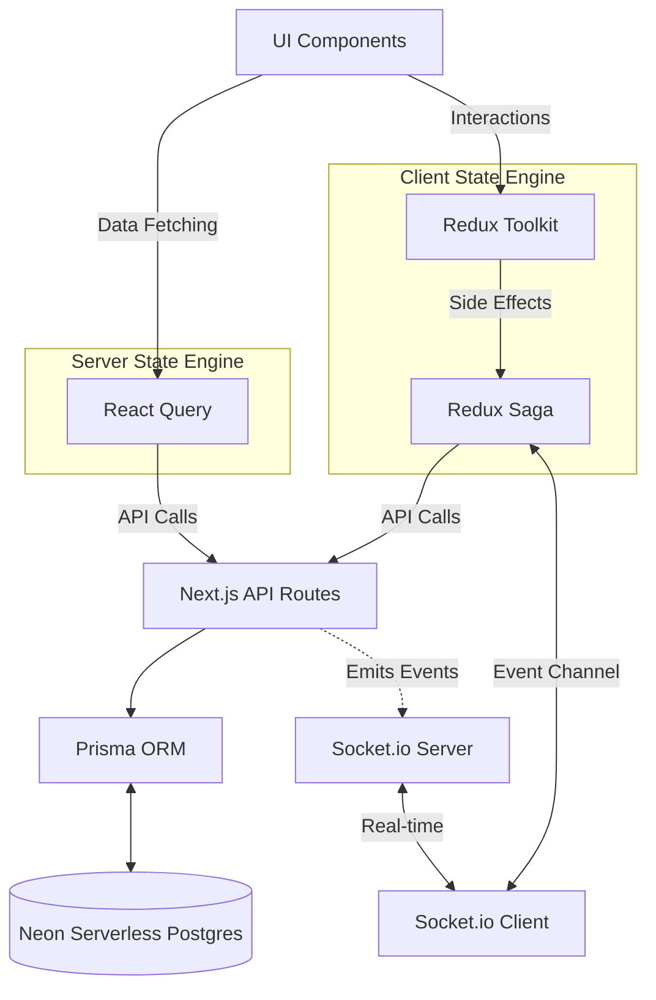

<div align="center">
  <h1>🛒 Cart Redux Architecture Showcase</h1>
  <p>
    <strong>A production-ready implementation of complex state management in a Next.js application.</strong>
  </p>
  <p>
    
    
    
    
    
    
  </p>
</div>

## 📑 Table of Contents

- [Overview & Design Philosophy](#-overview--design-philosophy)
- [Architecture & State Management](#-architecture--state-management)
- [Key Features & Business Workflows](#-key-features--business-workflows)
- [Tech Stack & Libraries](#-tech-stack--libraries)
- [Project Structure](#-project-structure)
- [Getting Started](#-getting-started)
- [Testing](#-testing)
- [Deployment](#-deployment)
- [Development Roadmap](#-development-roadmap)

---

## 🎯 Overview & Design Philosophy

This project serves as an advanced sandbox and reference architecture for building robust web applications that require complex state management. Rather than building a simple CRUD app, this repository demonstrates how to elegantly handle race conditions, optimistic UI updates, request debouncing, and real-time bidirectional communication.

**Core Ideologies:**

1. **Strict Separation of Concerns (SoC):** Clearly separating Server State (managed by React Query) from Client State (managed by Redux Toolkit).
2. **Performance First:** Utilizing **Optimistic Updates** to ensure the UI reacts instantly (zero perceived latency) and **Debouncing** to prevent backend API abuse during rapid user interactions.
3. **Scalable Architecture:** Adopting a feature-sliced directory structure where components, state slices, sagas, and hooks are grouped by feature domain.
4. **Resilience:** Graceful error handling and automated state rollbacks in case of API failures.

---

## 🧠 Architecture & State Management

The application employs a dual-engine state management strategy to leverage the best tools for specific jobs.



### The Dual-Engine Strategy

- **React Query (`@tanstack/react-query`)**: Exclusively handles **Server State** (e.g., fetching the product list). It takes care of caching, background re-fetching, deduplication, and loading states seamlessly.
- **Redux Toolkit + Saga + Thunk**: Exclusively handles **Client State & Complex Async Flows** (e.g., the Cart).
  - **Redux Thunk** is used for simple, straightforward API calls.
  - **Redux Saga** is the orchestrator for complex side-effects, handling debouncing of cart quantity changes, optimistic update rollbacks, and mapping real-time WebSocket streams into Redux actions.

---

## ⚙️ Key Features & Business Workflows

### 1. Advanced Cart Operations (Optimistic & Debounced)

When a user rapidly clicks "+" to increase an item's quantity:

1. **Optimistic Update:** Redux instantly updates the store. The UI reflects the new quantity immediately.
2. **Debouncing (Saga):** Redux Saga intercepts the actions. Instead of firing 10 API requests for 10 clicks, it waits for the user to pause (e.g., 500ms) before firing a single API request with the final quantity.
3. **Rollback Mechanism:** If the API request fails, Saga automatically triggers a rollback action to revert the Redux state to its previous truth, showing a toast error to the user.

### 2. Real-time Notifications via WebSockets

- **Event Channels:** Redux Saga uses the `eventChannel` pattern to establish a connection with the Socket.io server.
- **Reactive UI:** When systemic events occur (e.g., a successful checkout), the server broadcasts a message. The Saga translates this WebSocket event into a standard Redux action, seamlessly updating the Notification Bell UI.

### 3. Persistent Cart State

Cart data is actively synchronized with a **Neon Serverless Postgres** database, ensuring that users do not lose their cart contents across sessions or devices.

---

## 🛠 Tech Stack & Libraries

| Category         | Technology                     | Purpose                                                  |
| :--------------- | :----------------------------- | :------------------------------------------------------- |
| **Framework**    | Next.js (App Router), React 19 | Core application framework and routing.                  |
| **Language**     | TypeScript                     | End-to-end type safety.                                  |
| **Client State** | Redux Toolkit, React-Redux     | Predictable state container.                             |
| **Side Effects** | Redux Saga, Redux Thunk        | Managing complex async workflows and side-effects.       |
| **Server State** | @tanstack/react-query          | Data fetching, caching, and synchronization.             |
| **Database**     | Neon Postgres, Prisma ORM      | Serverless relational DB with type-safe database access. |
| **Real-time**    | Socket.io                      | Bidirectional event-based communication.                 |
| **Styling**      | TailwindCSS v4                 | Utility-first, highly performant CSS framework.          |
| **Testing**      | Jest, redux-saga-test-plan     | Unit testing sagas, reducers, and core logic.            |

---

## 📁 Project Structure

The project follows a **Feature-Sliced Design** methodology.

```text
cart-redux-book/
├── prisma/                    # Database schema and seed scripts
├── src/
│   ├── app/                   # Next.js App Router & API Routes
│   ├── components/            # Shared UI components
│   ├── features/              # Feature-based modules (Domain Logic)
│   │   ├── cart/              # Cart UI, Slice, Saga, Thunks, Tests
│   │   ├── notification/      # Notification Slice, Socket Saga
│   │   └── products/          # Product components and React Query hooks
│   ├── lib/                   # Singletons, utilities, and configs
│   ├── store/                 # Redux Store configuration & root reducers/sagas
│   └── types/                 # Global TypeScript definitions
├── server.ts                  # Custom Next.js server integrating Socket.io
└── Dockerfile                 # Containerization config
```

---

## 🚀 Getting Started

### 1. Prerequisites

- Node.js (v18 or higher)
- A [Neon](https://neon.tech/) account (for Serverless Postgres)

### 2. Environment Setup

Clone the repository and create your `.env` file based on `.env.example`:

```env
DATABASE_URL="postgresql://<user>:<password>@<neon-host>/<db>?sslmode=require"
```

### 3. Installation & Database Preparation

```bash
# Install dependencies (will automatically run prisma generate)
npm install

# Push schema to Neon database
npm run prisma:migrate -- --name init

# Seed database with initial products
npm run db:seed
```

### 4. Running the Development Server

Because this app uses WebSockets, it runs via a custom `server.ts` rather than the default Next.js dev server.

```bash
npm run dev
```

Open [http://localhost:3000](http://localhost:3000) with your browser to see the result.

---

## 🧪 Testing

The core business logic (Reducers and Sagas) is covered by Jest. `redux-saga-test-plan` is used to elegantly test complex saga execution flows.

```bash
# Run unit tests
npm test

# Run tests in watch mode
npm run test:watch
```

---

## ☁️ Deployment

### Docker

The application is fully containerized. Since it relies on a managed Neon database, the Docker setup only runs the application container.

```bash
docker compose up --build
```

### Render Deployment

This application is configured and ready to be deployed on Render as a Web Service. The custom Next.js server ensures that both HTTP traffic and WebSocket connections are handled seamlessly on the deployed environment.

---

## 🗺 Development Roadmap

- [x] **Phase 1:** Next.js + Tailwind + Prisma + Redux Skeleton Setup
- [x] **Phase 2:** Core Redux Cart (Thunks, Sagas, Debouncing, Optimistic Updates)
- [x] **Phase 3:** UI Integration (React Query Products + Redux Cart Panel)
- [x] **Phase 4:** WebSocket Integration (Socket.io + Redux Saga Event Channels)
- [x] **Phase 5:** CI/CD via GitHub Actions & Extensive Test Coverage
- [ ] **Phase 6:** Advanced Background Job Processing (e.g., BullMQ for Order pipelines)
